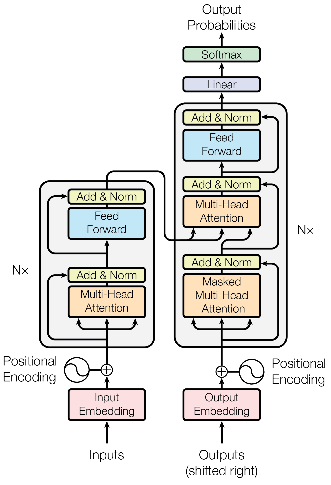
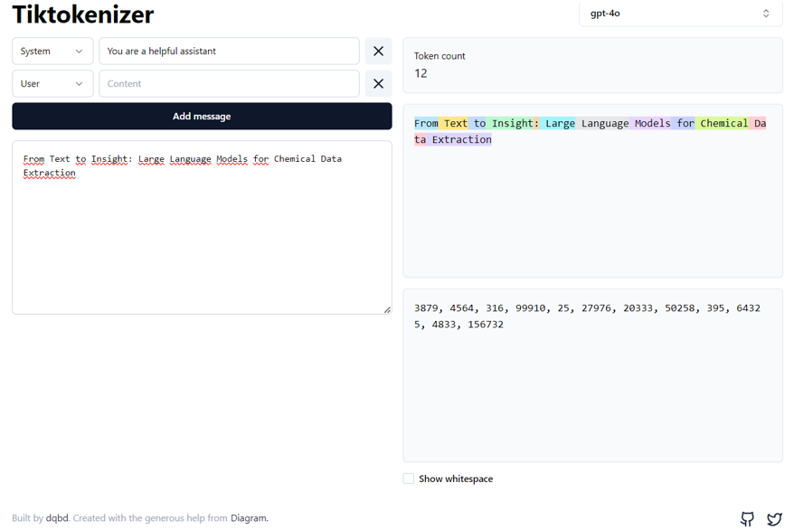

# 2 Overview on the working principles of LLMs

In this notebook, we have compiled a list of valuable resources to help you understand how Large Language Models (LLMs) work. Here you will find accessible explanations of the fundamental principles behind these models.

## :computer: Online resources
### Transformers
>[!NOTE]
>Transformers have emerged as the leading architecture for addressing natural language processing (NLP) tasks, enabling the development of powerful language models. Introduced in the landmark 2017 paper *"Attention Is All You Need"* by Google researchers, the Transformer architecture has revolutionized the field. To understand the fundamentals of Transformers, you can explore the resources shown below. *(Figure - The Transformer, model architecture. Source: ["Attention Is All You Need"](https://arxiv.org/abs/1706.03762) paper)*.

* [The Annotated Transformer](https://nlp.seas.harvard.edu/annotated-transformer)
  This post presents an annotated version of the paper *"Attention is All You Need"* from Harvard University in the form of a line-by-line implementation. It reorders and deletes some sections from the original paper and adds comments throughout. Thus, it explains the model architecture (Transformer), model training, and a real-world example. This document is a notebook that allows a completely usable implementation.
* [Understanding the Transformer architecture for neural networks](https://www.jeremyjordan.me/transformer-architecture)
  In this article, Jeremy Jordan explains the Transformer architecture with a focus on the attention mechanism, encoder, decoder, and embeddings. His didactic approach is enriched with many explanatory schemas, making the concepts easy to understand.
* [The Illustrated Transformer](https://jalammar.github.io/illustrated-transformer) In this post, Jay Alammar demystifies how Transformers work. He simplifies complex concepts like encoders, decoders, embeddings, self-attention mechanisms, and model training by explaining each one individually, using numerous schemas to enhance understanding.
* [The Transformer architecture of GPT models](https://bea.stollnitz.com/blog/gpt-transformer/) This article by Bea Stollnitz explains the architecture of GPT models, which are built using a subset of the original Transformer architecture. It shows a GPT-like version of the code that can be compared with the original Transformer to understand the differences.
* [A walkthrough of transformer architecture code](https://github.com/markriedl/transformer-walkthrough) This notebook provides a comprehensive walkthrough of the Transformer architecture code. It guides you through a single forward pass, explaining each stage of the architecture with the help of a detailed computation graph. This resource is designed for illustration and educational purposes.
* [LLM Visualization](https://bbycroft.net/llm) Here, Brendan Bycroft shows an impressive interactive visualization of the LLM algorithm behind some of the OpenAI GPT models, allowing you to see the entire process in action.
  
:movie_camera: You can also find a clear explanation of Transformers in the following video:\
        *Sebastian Raschka*\
&nbsp;&nbsp;&nbsp;&nbsp;[The Transformer Architecture](https://www.youtube.com/watch?v=tstbZXNCfLY)

### Attention
>[!NOTE]
>The concept of "attention” in deep learning emerged from the need to improve Recurrent Neural Networks (RNNs) for handling longer sequences or sentences. Working word-by-word is not effective. To overcome this issue, attention mechanisms were introduced to give access to all sequence elements at each time step. The key is to be selective and determine which words are most important in a specific context. The transformer architecture revolutionized this approach by introducing a standalone self-attention mechanism, eliminating the need for RNNs altogether. To understand the attention mechanisms, you can explore the resources shown below. *(Figure - Computing the Attention Scores. Source: ["Self-attention from schatch"](https://sebastianraschka.com/blog/2023/self-attention-from-scratch.html) post by S. Raschka)*.

>[!IMPORTANT]
>The attention mechanism is what makes the Transformer architecture unique and distinct from recurrent approaches to language modeling.

* [Understanding the attention mechanism in sequence models](https://www.jeremyjordan.me/attention) In this post, Jeremy Jordan shows a fundamental understanding of the attention mechanism, using numerous helpful diagrams and an accessible language style. You can understand how the attention mechanism enables the decoder to search across the entire input sequence for information at each step during the output sequence generation. This is a key innovation in sequence-to-sequence neural network architectures because it significantly improves model performance.
* [Attention? Attention!](https://lilianweng.github.io/posts/2018-06-24-attention) This post by Lilian Weng also includes detailed explanations and numerous useful diagrams to understand the attention mechanism.
* [Understanding and Coding the Self-Attention Mechanism of Large Language Models From Scratch](https://sebastianraschka.com/blog/2023/self-attention-from-scratch.html) In this post, Sebastian Raschka explains how self-attention works from scratch by coding it step-by-step.

:movie_camera: You can also find valuable information about the attention mechanism in the following videos:\
    *Sebastian Raschka*\
&nbsp;&nbsp;&nbsp;&nbsp;[Using Attention Without the RNN -- A Basic Form of Self-Attention](https://www.youtube.com/watch?v=i_pfHD4P_wg)\
&nbsp;&nbsp;&nbsp;&nbsp;[Self-Attention and Scaled Dot-Product Attention](https://www.youtube.com/watch?v=0PjHri8tc1c)\
&nbsp;&nbsp;&nbsp;&nbsp;[Multi-Head Attention](https://www.youtube.com/watch?v=A1eUVxscNq8)\
        *DeepLearningAI*\
&nbsp;&nbsp;&nbsp;&nbsp;[Attention Model Intuition](https://www.youtube.com/watch?v=SysgYptB198)\
&nbsp;&nbsp;&nbsp;&nbsp;[Attention Model](https://www.youtube.com/watch?v=quoGRI-1l0A)

### Tokenization and embeddings
>[!NOTE]
>Tokenization and embeddings are two essential steps in the data processing pipeline of LLMs. Tokens are the fundamental units of LLMs. Tokenization is the process of translating text into sequences of tokens and vice versa, breaking down the text into manageable pieces that the model can interpret. Once the text is tokenized, each token is mapped to an embedding vector. These embeddings are dense, low-dimensional, continuous vector representations that capture the semantic and syntactic meanings of tokens, allowing the model to understand the nuances of language. These vectors are learned during the model’s training process. For more information on tokenization and embeddings, you can explore the resources listed below. *(Figure - [Tiktokenizer](https://tiktokenizer.vercel.app/))*

* [The Technical User's Introduction to LLM Tokenization](https://christophergs.com/blog/understanding-llm-tokenization) In this post, Christopher Samiullah delves into the mechanics of tokenization in LLMs, referencing Andrej Karpathy’s YouTube talk *[Let’s build the GPT Tokenizer](https://www.youtube.com/watch?v=zduSFxRajkE)*.
* [Let’s build the GPT Tokenizer](https://www.youtube.com/watch?v=zduSFxRajkE) If you want to dive deeper into this topic, check out the mentioned talk by Andrej Karpathy, where he builds from scratch the Tokenizer used in the GPT series from OpenAI, highlighting "weird behaviors" and common issues associated with tokenization. He also created `minbpe`, a [repo](https://github.com/karpathy/minbpe) with code and exercises fur further learning.
* [Tiktokenizer](https://tiktokenizer.vercel.app/) You should check out this link and try tokenization using the Tiktoken web app. With this tool, tokenization runs live in your web browser, allowing you to easily input some text string on the left and see the tokenized output on the right side in real-time.
* [What Are Word and Sentence Embeddings?](https://cohere.com/blog/sentence-word-embeddings) In this post, Luis Serrano (Cohere) provides a straightforward introduction to embeddings using practical examples.

### Model training
* [nanoGPT](https://github.com/karpathy/nanoGPT/) The simplest, fastest repository for training/finetuning medium-sized GPTs by Andrej Karpathy. It includes a minimal code implementation of a generative language model for educational purposes.
* [Building a GPT that can generate molecules from scratch](https://kjablonka.com/blog/posts/building_an_llm) Here, Kevin Jablonka explains how LLMs work through a practical approach applied to materials science, guiding you on how to build a GPT model that can generate molecules from scratch. It includes a detailed tutorial covering the tokenization process, conversion of tokens into numbers, vector embeddings and positional encoding, as well as model training and evaluation. Through this relatively simple example, you will also learn how the attention mechanism works with an exhaustive implementation of self-attention into the model.
  
:movie_camera: In this video you can learn how to build a GPT model following the paper *"Attention is All You Need"*:\
    *Andrej Karpathy*\
&nbsp;&nbsp;&nbsp;&nbsp;[Let's build GPT: from scratch, in code, spelled out](https://www.youtube.com/watch?v=kCc8FmEb1nY)

## :blue_book: Books
* [Natural Language Processing with Transformers](https://www.oreilly.com/library/view/natural-language-processing/9781098136789)\
  *(Lewis Tunstall, Leandro von Werra, Thomas Wolf (2022) O'Reilly Media, Inc. ISBN: 9781098136796)*\
  While the overall objective of this book is to show you how to build language applications using the 🤗 Hugging Face Transformers library, it explains the Transformer architecture in a clear and detailed way. Chapter 2, *Text Classification*, shows how tokenizers work, whereas Chapter 3, *Transformer Anatomy*, takes a closer look at how transformers work for natural language processing. You will learn about the encoder-decoder architecture, embeddings, and self-attention mechanism. The authors present a hands-on approach making it easy to read and simple to understand the complex Transformer architecture.
* [Generative Deep Learning](https://www.oreilly.com/library/view/generative-deep-learning/9781098134174)\
  *(David Foster (2023) O'Reilly Media, Inc. ISBN: 9781098134181)*\
  Starting with an introduction to generative modeling and deep learning, this book explores the different techniques to build generative models. In Chapter 9, *Transformers*, it provides an overview of the Transformer model architecture, attention mechanism, and encoder-decoder architectures.

