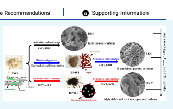

# Selectable Microporous Carbons Derived From Poplar Wood By Three Preparation Routes For Co2 Capture Lishu Shao,* Yafei Sang, Na Liu, Jun Liu, Peng Zhan, Jianhan Huang, And Jienan Chen*

Cite This: ACS Omega 2020, 5, 17450−17462 Read Online

ACCESS Metrics & More Article Recommendations *sı Supporting Information
ABSTRACT: Biomass-derived porous carbons are one kind of sustainable, extensive, and flexible carbon material for CO2 capture.

Here, we prepared several microporous carbons from poplar wood by three preparation routes. Especially, the residues of the poplar wood after the bioethanol process were explored as precursors to prepare activated carbon by KOH and ZnCl2 activation. By the adjustment of the preparation routes and the optimization of the activation conditions, these porous carbons exhibited diversified morphology (sponge, nanosheets, and honeycomb structure),
tunable porosity (specific surface areas: 511−2153 m2/g), and narrow micropore distribution (0.55−1.2 nm). These carbons had a high CO2 uptake of up to 217 mg/g at 273 K and 1 bar, which was comparable with those of many N-doped porous carbons, and possessed moderate isosteric heat of CO2 adsorption (21.1−43.2 kJ/mol), good cyclic ability, and high CO2/N2 selectivity (Henry's law: 44.0). The results indicated that CO2 uptake of these carbons was mainly decided by their micropore volume (d < 1.0 nm) at 273 K and 1 bar. This work provides an important reference for preparing promising CO2 adsorbents with tunable structures from similar biomass resources.

## 1. Introduction

With the burning of vast amounts of fossil fuel, excessive emissions of carbon dioxide (CO2) cause various environmental issues such as global warming, rising sea level, and land desertification.1−3 Simultaneously, CO2 as a feed gas can also be converted into energy and chemicals in C-1 chemistry.4 Therefore, it is essential to develop carbon capture and storage
(CCS) technologies to reduce CO2 concentration in the atmosphere. The traditional commercial CO2 capture using aqueous ethanolic amines by chemical absorption is highly effective and mature, but it has intrinsic drawbacks such as high regeneration costs and severe corrosion.5 Notably, the solid adsorbent bed composed of porous materials in a pressure, temperature, and vacuum swing adsorption (P/T/VSA) gas separation system could selectively adsorb CO2 from a humid flue gas; in this way, it has been attracting increasing attention owing to its low cost and environmentally friendly merits in recent years.6−8 Carbon-based materials, such as graphene,9 nanotubes, and nanoporous carbons,10−13 are one of the most advanced adsorbents including porous organic polymers (POPs),14−18 zeolites,19 and metal−organic frameworks (MOFs)20 because of their high specific areas, strong hydrophobicity, low density, and excellent stability. As known, porous carbons can be prepared from various precursors, such as organic small molecules, MOFs, mineral coal, synthetic polymers, and biomass.21 Among them, biomass-derived porous carbons as renewable, eco-friendly, and cost-effective functional materials have been extensively developed and applied to many fields such as inks, fuel cells, supercapacitors, catalysts, and adsorbents.22,23 This biomass included catkin, peanut shell, corn stalk, chitosan, and so on.24−26 Recently, considering that they pose threats to human health (respiratory ailments and skin anaphylaxis), porous carbons derived from poplar catkins (PCs) with rich lignin and amino acids, special morphology of microtubes, and high nitrogen content (>4%) have gained considerable attention23,27,28 and have been effectively applied in supercapacitors, adsorbents, electrocatalysts, and oil/water separation.29−32 However, there have been few studies on porous carbons derived from poplar wood sawdust (PWS), a waste product from the wood processing industry, especially on their preparation and applications, such as in gas adsorption and separation fields. Therefore, we selected PWS as the raw material to achieve porous carbons with excellent microporosity and various morphologies via different preparation routes for outstanding CO2 capture.

At present, there are several preparation routes for biomassderived porous carbons, such as directed activation carbon-
Received: April 25, 2020

 Accepted: June 26, 2020 Published: July 10, 2020

© 2020 American Chemical Society 17450https://dx.doi.org/10.1021/acsomega.0c01918 ACS Omega 2020, 5, 17450−17462

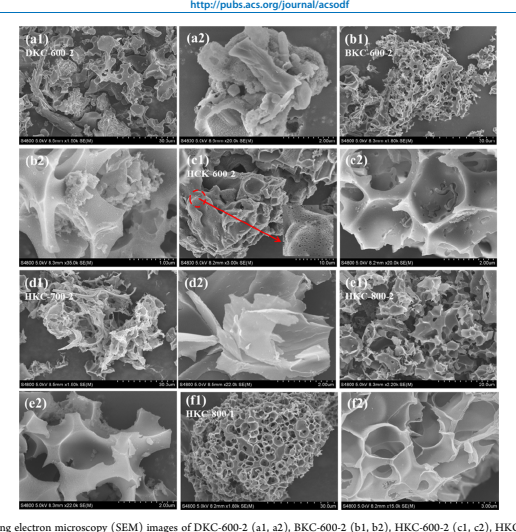

ization, hydrothermal treatment and activation, precarbonization and activation, and biotreatment and activation carbonization.22,23,30,33−37 For example, Chang et al.23 reported PCderived hierarchical carbon microtubes by precarbonization, followed by ZnCl2 chemical activation, which showed high CO2 uptake values of 6.22 and 4.05 mmol/g at 273 and 298 K,
at 1 bar, respectively. Gao et al.30 prepared versatile biomassderived carbon materials (surface area: 1351.4−1525.3 m2/g)
by direct carbonization of catkin under ZnCl2 activation for the oxygen reduction reaction, supercapacitors, and oil/water separation. Xu et al.37 used lignin-derived byproducts
(LDBs) after bioethanol production to prepare an interconnected hierarchical porous N-doped carbon (HPNC)
(surface area: 2218 m2/g) by KOH activation, and it exhibited favorable properties for supercapacitors. In ref 37, a mass of LDB was produced as the residue after the biotreatment (enzymatic hydrolysis and fermentation) of lignocellulose. On the other hand, activation methods are also critical for the formation and development of carbon materials with a welldeveloped porous structure. Compared with physical activation, chemical activation has several advantages including simplicity, lower activation temperature, shorter activation time, and higher yield, and it has been popular for remarkably improving the porosity of the generated carbon materials. For example, Manyà et al.33 prepared several activated carbons
(ACs) from vine shoot-derived biochar using CO2 and KOH
activation, and the ACs obtained by KOH impregnation exhibited the highest CO2 adsorption capacity (6.04 mmol/g at 273 K and 1.0 bar). Rao et al.38 prepared N-rich porous sorbents by co-hydrothermal treatment of D-glucose and urea, followed by KOH activation. GN-650-1 with a surface area of 1734 m2/g showed high CO2 uptake values of 4.26 and 6.70 mmol/g at 298 and 273 K, respectively. In the above process, the control of the activator type and dosage, temperature, and residence time was vital for CO2 capture performance of the activated carbons.

Broadly speaking, different preparation routes and activation conditions would largely affect the physicochemical structure, yields, etc. of the produced porous carbons and thus decide their performance in practical applications. For CO2 capture and storage, excellent microporosity and rich heteroatom (N,
O, S) doping are very important for improving their CO2 adsorption capacity and CO2/N2 selectivity.39 Especially, Ncontaining groups such as pyridine nitrogen and pyrrole nitrogen were usually introduced in carbon frameworks to provide enough interaction sites for CO2 capture.9,24 Meanwhile, O doping also inevitably occurred on the carbon surface during activation, and the generated O-containing groups included −CO, C−OH, and C−O−C; they could form hydrogen bonds between −OH groups and CO2 molecules.

Here, we tried to prepare selectable porous carbons from PWS by different preparation routes and careful adjustment of

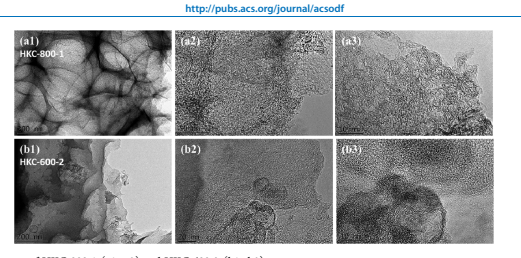

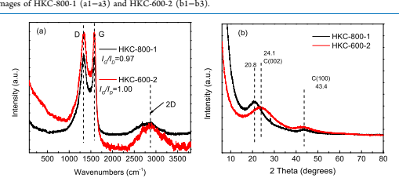

the activation conditions. Three preparation routes including direct activation carbonization, hydrothermal treatment and activation carbonization, and biotreatment and activation carbonization were selected based on the research of our groups and the universal use of these routes. Our aim was to investigate the effects of these preparation routes and the corresponding activation conditions on the structural features and CO2 adsorption of PWS-derived porous carbons by a comparative study. Especially, the porosity and microstructure of these porous carbons were well tuned by changing the activation conditions, and they exhibited diversified morphology, tunable porosity, narrow micropore distribution, and high CO2 uptake. This work will provide fundamental guidance for the preparation of porous carbons from renewable lignocellulose resources.

## 2. Results And Discussion

2.1. Macroscopic Shape, Surface Morphology, and Phase Structure Analysis. PWS as the raw material was converted into porous carbons by three routes, which produced different physicochemical structures. The digital photographs of all precursors and porous carbons are shown in Figure S1. The white PWS changed into brown BPWS powder and black HPWS sawdust. After activated carbonization, we found that all KOH-activated porous carbons became an irregular powder, while ZnCl2-activated porous carbons changed into a complete monolith with definite strength; especially, BZC-600-2 exhibited stability in 2 mol/L HCl solution and had low density like aerogels. Figure 1 shows the typical morphology and microstructure of these carbons. DKC600-2 was composed of irregular carbon blocks and particles with a rough surface (Figure 1a1,a2); BKC-600-2 had a spongelike network structure with interconnected pores, and its rough surface also accumulated some small carbon particles. Interestingly, a large proportion of the surface of HKC-600-2 possessed vast wormhole-like structures with macropores of 50−100 nm, which was very beneficial for the fast transmission and diffusion of CO2 molecules.

When the activation temperature increased, many stacked nanosheets appeared in HKC-700-2, and some irregular particles and blocks could be seen in HKC-800-2. When the mass ratio of KOH to HPWS was 1:1, a honeycomb structure appeared in the carbon skeleton of HKC-800-1, and the open pores with thin pore walls were interconnected in hierarchical porous carbon. These results indicated that morphologies of PWS-derived porous carbons could be tuned to a specific shape by changing activation conditions in the preset routes.

As representatives, the transmission electron microscopy
(TEM) images of HKC-600-2 and HKC-800-1 were investigated. HKC-800-1 shows an interlaced network with a spherical mesh (Figure 2a1), and an amorphous structure was formed in the porous carbon networks, which was consistent with the X-ray diffraction (XRD) results. Its high-resolution FE-TEM image (Figure 2a3) exhibits alternately dark and bright microstructures with extensive sizes, indicating plentiful micropores and a few mesopores. The TEM images of HKC600-2 show thin sheets and particles (Figure 2b1), which may be a mixture of graphene-like layers and amorphous structure,

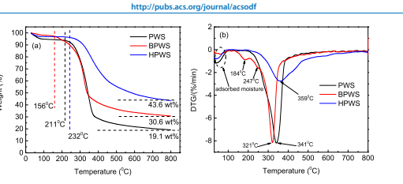

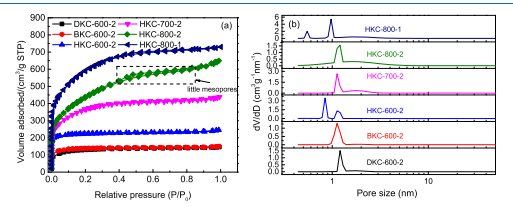

and the high-resolution FE-TEM image (Figure 2b3) revealed more serried wormhole-like microstructures and a few stripe structures.

The Raman spectra of carbon materials are shown in Figure 3a. Two dominant characteristic peaks are attributed to the symmetrical vibration of the sp2 phase at 1583 cm−1 and the defective structure at 1332 cm−1, respectively, corresponding to the G-band and D-bands.41 The intensity ratio of IG/ID
reflected the degree of graphitization of porous carbons, and the value of IG/ID of HKC-600-2 (1.00) was higher than that of HKC-800-1 (0.97), indicating that HKC-600-2 had a more ordered structure and a higher graphitization degree. Figure 3b exhibits the XRD pattern of porous carbons. For HKC-600-2, two broad diffraction peaks appeared at 2θ = 24.1 and 43.4°,
suggesting that the amorphous phase was dominant; correspondingly, the two peaks can be attributed to the reflection (002) and (100) of the stacking graphitized carbon structure.42 The diffraction peaks of HKC-800-1 showed a slight shift (2θ = 20.8 and 43.4°), and its XRD spectra showed a sharp diffraction peak (2θ = 28.1°) with low intensity, which can be ascribed to the slight impurities of siliceous compound crystals from the weak reaction between the activator KOH
and the porcelain boat composed of SiO2. Additionally, there appeared a rapid increase in the intensity of the diffraction peaks at the low-angle region (2θ < 10°), which indicated the high porosity of the two carbon materials.43 2.2. Thermostability and Carbon Yields. The thermogravimetric (TG) and derivative thermogravimetric (DTG)
analysis curves of three precursors (PWS, BPWS, HPWS) were measured to study their thermostability and decide the activation temperature (Figure 4). Three precursors exhibited similar TG curves (Figure 4a), but the initial decomposition temperature was different, which was about 211 °C (PWS),
156 °C (BPWS), and 232 °C (HPWS). The lowest decomposition temperature of BPWS could be ascribed to the remaining microbial protein and polysaccharides adhering to it. HPWS showed the highest decomposition temperature due to its enhanced robust structure after the hydrothermal process.44 The weight of the three precursors mainly kept constant above 600 °C; the residues of PWS, BPWS, and HPWS were about 19.1, 30.6, and 43.6 wt %, respectively.

Hence, the temperature of 600 °C was used as the initial activation temperature. The TGA curves (Figure 4b) more clearly revealed the weight loss process; the loss below 100 °C
was mainly from the adsorbed moisture, and the strongest weight loss peaks were 341, 321, and 359 °C corresponding to PWS, BPWS, and HPWS. The peak shape of HPWS had an evident difference compared with the other two, which could be due to its more robust structure formed by the intense condensation polymerization and aromatization during the hydrothermal process.44 The DTA curves of these samples suggested that the total process was mainly endothermic (Figure S2), and BPWS and HPWS had weak exothermic peaks at about 517, 556, and 678
°C; the reason could be that these generated small-molecule gases and condensational volatiles were formed under exothermic reactions. The yields of these samples are summarized in Table S1. As for the yields of the porous carbons before and after activation, ZnCl2-activated carbons had much higher yields (34.5−58.2%) than KOH-activated carbons (4.81−32.9%). Additionally, with the activation temperature or activator dosage increased, the yields of porous

| Table 1. Porous Properties and Elemental Content of Porous Carbons Derived from Poplar Wood Sawdust samples SBETa Vtotalb Vmicroc V(d < 1 nm)d V(d < 0.7 nm)d DA e C (%) N (%) H (%)                                                                                                     | Of (%)   |      |            |        |        |      |       |       |      |       |
|------------------------------------------------------------------------------------------------------------------------------------------------------------------------------------------------------------------------------------------------------------------------------------------|----------|------|------------|--------|--------|------|-------|-------|------|-------|
| DKC-600-2                                                                                                                                                                                                                                                                                | 511      | 0.22 | 0.17(77.3) | 0.0010 | 0.00   | 1.77 | 73.44 | <0.01 | 2.06 | 24.50 |
| BKC-600-2                                                                                                                                                                                                                                                                                | 535      | 0.23 | 0.22(95.7) | 0.026  | 0.00   | 1.74 | 57.18 | <0.01 | 1.35 | 41.46 |
| HKC-600-2                                                                                                                                                                                                                                                                                | 893      | 0.38 | 0.33(86.8) | 0.24   | 0.0064 | 1.70 | 70.87 | 0.00  | 1.37 | 27.75 |
| HKC-700-2                                                                                                                                                                                                                                                                                | 1339     | 0.68 | 0.52(76.5) | 0.0051 | 0.00   | 2.02 | 85.84 | <0.01 | 1.14 | 13.02 |
| HKC-800-2                                                                                                                                                                                                                                                                                | 1587     | 1.00 | 0.55(55.0) | 0.071  | 0.017  | 2.53 | 48.27 | 0.00  | 1.24 | 50.49 |
| HKC-800-1                                                                                                                                                                                                                                                                                | 2153     | 1.13 | 0.85(75.2) | 0.52   | 0.088  | 2.09 | 85.11 | 0.00  | 0.66 | 14.23 |
| a Calculated using the BET model with the unit of m2 /g. b Calculated at P/P0 = 0.99 with the unit of cm3 /g. c Cumulative micropore volume with pore size <2.0 nm using the NLDFT model with the unit of cm3 /g. d Cumulative narrow micropore volume with pore size <1.0 nm or <0.7 nm |          |      |            |        |        |      |       |       |      |       |

carbons were expectedly decreased. The total yields for the three routes originating from PWS were 2.52−16.44% for KOH activation and 15.92−34.50% for ZnCl2 activation.

Among them, DZC-600-2 had the highest total yield of 34.50%, which could be ascribed to the carbonization of the most original components with the help of ZnCl2 activators. In short, the yields of these carbons were acceptable for practical production.45 2.3. Porous Texture Studies. According to the results of CO2 capture performance, we selected partial porous carbons as representatives and measured the N2 adsorption−desorption isotherms (Figure 5).

According to the International Union of Pure and Applied Chemistry (IUPAC) classification,46 all isotherms could be identified as the Type-I isotherms except for HKC-800-2, which belonged to a combination of Type-I and Type-IV. At P/P0 < 0.005, the N2 uptake of all carbons has a rapid increase, indicating abundant micropores, and then, there appeared a mild rise at 0.05 < P/P0 < 0.3 for HKC-700-2, HKC-800-2, and HKC-800-1, implying the presence of some mesopores, while the isotherms of DKC-600-2, BKC-600-2, and HKC-600-2 all kept constant at P/P0 > 0.01, suggesting almost no mesopores or macropores, and finally, all isotherms leveled off in the high P/P0 region. Notably, the N2 adsorption−desorption isotherms of HKC-800-2 revealed a prominent Type-H4 hysteresis loop due to the capillary condensation from some mesoporous structures.46 The structural parameters of these carbons are summarized in Table 1. DKC-600-2, BKC-600-2, and HKC600-2 prepared under the same activation conditions had different porosities; for example, their SBET was 511, 535, and 893 m2/g and their Vmicro was 0.17, 0.22, and 0.33 cm3/g, respectively. The results demonstrated that the two-step routes, especially the hydrothermally combined activation routes, could endow the porous carbons with higher SBET and Vmicro. Thus, the following study mainly focused on the HKC
materials from the third route. For HKC-600-2, HKC-700-2, and HKC-800-2, with the increase in activation temperature, SBET, Vtotal, Vmicro, and DA increased, and SBET and Vtotal of HKC-800-2 reached 1587 m2/g and 1.00 cm3/g, respectively.

Interestingly, when the activator dosage was adjusted to 1:1, the obtained HKC-800-1 had the largest SBET (2153 m2/g), Vtotal (1.13 cm3/g), and Vmicro (0.85 cm3/g). These results suggested that a higher activation temperature could result in larger porosity, but the increase in activators had not necessarily enhanced the porosity, especially microporosity. The pore size distribution (PSD) in Figure 5b revealed the dominant pore size in these carbons. DKC-600-2, BKC-600-2, HKC-700-2, and HKC-800-2 had similar micropore distributions concentrated at 1.1 and 1.2 nm, while HKC-600-2 and HKC-800-1 had two characteristic peaks focused at 0.85 and 1.1 nm and 0.55 and 0.97 nm, respectively, and HKC-800-1 had a smaller pore size with a higher intensity of 5.4 cm3 (g/
nm). In addition, the PSD curves of individual samples obtained by the NLDFT model or the BJH model (Figures S3 and S4) showed the presence of mesoporosity in some samples, such as HKC-700-2, HKC-800-2, and HKC-800-1.

They possessed mesopores with the pore size of 2−5 nm. The results were in accordance with the N2 adsorption isotherms.

The curves of the cumulative pore volume vs pore size are also shown in Figure S5. The pore volume of different pore size regions could be found; for example, the pore volumes of d < 1 nm were 0.0010, 0.026, 0.24, 0.0051, 0.071, and 0.52 cm3/g corresponding to DKC-600-2, BKC-600-2, HKC-600-2, HKC700-2, HKC-800-2, and HKC-800-1. The above results implied that the porous structure of PWS-derived carbons could be regularly adjusted by the preparation routes, especially the activation conditions.

2.4. Chemical Structure and Composition. The chemical structure of these porous carbons was measured by elemental analysis (EA) and Fourier transform infrared (FTIR) spectroscopy. The C, N, O, and H contents of the samples are provided in Table 1. The N content of all porous carbons was almost zero (<0.01 wt %). DKC-600-2 and HKC-600-2 had similar elemental compositions, and C content of both samples reached more than 70 wt %, while BKC-600-2 had a lower C content (57.18 wt %) and higher O content (41.46 wt
%), which could be due to the adhered polysaccharides on BPWS.37 With increase of activation temperature, the O
content of HKC-800-2 increased to about 50 wt %, but the O content (14.23 wt %) of HKC-800-1 was low. The above results suggested that the use of a larger amount of KOH at high temperatures could lead to more O atoms being doped into the carbon skeletons, which could be because of the enhanced surface reoxidation between reactive carbon sites and excess KOH.71 The FT-IR spectra of HPWS and HKCs show the change of functional groups in the third route (Figure 6). HPWS
exhibited strong absorption peaks at 2929 cm−1 for −CH2, 1697 cm−1 for −CO−, 1645 and 1540 cm−1 for aromatic ketone, and 1460 cm−1 from benzene rings. After activation carbonization, most of these characteristic peaks became weak, even disappeared, and these porous carbons retained some characteristic peaks from the aromatic ring. Notably, the bands of these carbons at 1087 cm−1 from the stretching vibration of
−C−O−C became broader and stronger, which could be because of enhancement during KOH etching of the carbon framework, and HKC-800-2 showed the strongest absorption for −C−O−C, which was consistent with EA results.

ACS Omega http://pubs.acs.org/journal/acsodf Article

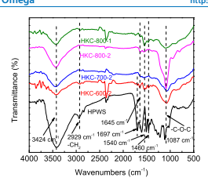

2.5. CO2 Capture Capacity. The CO2 adsorption

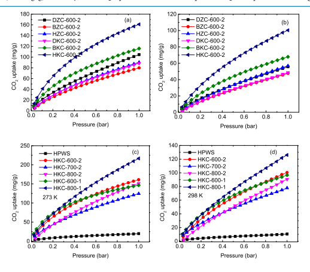

isotherms of all porous carbons at 273 and 298 K were measured in the pressure range of 0−1 bar (Figures 7 and S6).

First, Figure 7a,b shows CO2 adsorption isotherms of these porous carbons prepared from three different routes. Their CO2 uptake changed from 80.0 to 161.1 mg/g at 273 K and 1 bar and revealed that KOH-activated porous carbons had higher CO2 uptake compared with the corresponding ZnCl2activated porous carbons except for DKC-600-2 and DZC-6002, which can be attributed to the different activation mechanism and precursor features.23,30 Among KOH-activated porous carbons, BKC-600-2 had a CO2 uptake of 116.0 mg/g at 273 K and 1 bar, which showed an increase of 31.1% relative to DKC-600-2 (88.5 mg/g). Similarly, the CO2 uptake of HKC-600-2 was 54.6 and 161.1 mg/g at 0.15 and 1 bar, at 273 K, respectively, with an increase of 114.1 and 82.0% compared to DKC-600-2. This clearly demonstrated that the bioethanol process and hydrothermal treatment were effective steps for improving CO2 adsorption of porous carbons.

The following study focused on the performance optimization of HKCs. With an increase of the activation temperature, the CO2 uptake at 273 K and 1.0 bar slightly decreased, and the values were 161.1, 124.5, and 151.6 mg/g corresponding to HKC-600-2, HKC-700-2, and HKC-800-2. HKC-800-2 had the highest SBET of 1587 m2/g, but the CO2 uptake was not the largest, implying that SBET was not the dominating factor. To achieve higher CO2 uptake, we selected HKC-600-2 and HKC800-2 for further optimization, and the previous references indicated that excess activators could lead to severe etching and the collapse of the micropore structure.38,47 Hence, HKC600-1 and HKC-800-1 were prepared by reducing the amount of activators, and the CO2 uptake of both reached 146.5 and 217 mg/g, respectively, suggesting that the appropriate activation dosage was very important at a high temperature.

The CO2 uptake of these porous carbons is summarized in Table 2. For ZnCl2-activated porous carbons, with an increase of the activation temperature (Table S2 and Figure S6), the CO2 uptake first increased and then slightly decreased, and the values were 90.3, 120.2, and 113.8 mg/g at 273 K and 1 bar. At 298 K and 1 bar, the CO2 uptake values of all porous carbons were in the range of 48.6−126.1 mg/g.

The CO2 uptake and textural properties of these porous carbons were compared with various carbon materials (Tables 3 and S3). Among free N-doped porous carbons, HKC-800-1 shows superior CO2 adsorption of 217 mg/g relative to Table 2. CO2 Capture Performance of Porous Carbons

| CO2 uptakea                                                                                                                                     | CO2 uptakeb   |          |         |            |                       |                |       |
|-------------------------------------------------------------------------------------------------------------------------------------------------|---------------|----------|---------|------------|-----------------------|----------------|-------|
| samples                                                                                                                                         | 1.0 bar       | 0.15 bar | 1.0 bar | N2 uptakea | Henry's law SCO2/N2 c | IAST SCO2/N2 d | Qst e |
| DZC-600-2                                                                                                                                       | 104.7         | 28.6     | 55.7    | 2.8        | 26.16                 | 319.0          | 28.3  |
| BZC-600-2                                                                                                                                       | 80.0          | 21.8     | 47.7    | 8.0        | 8.66                  | NA             | 22.7  |
| HZC-600-2                                                                                                                                       | 90.3          | 24.8     | 56.9    | NA         | NA                    | NA             | 21.1  |
| DKC-600-2                                                                                                                                       | 88.5          | 25.5     | 48.6    | 15.7       | 3.84                  | 27.8           | 26.4  |
| BKC-600-2                                                                                                                                       | 116.0         | 39.7     | 67.9    | 2.0        | 44.00                 | 442.0          | 28.1  |
| HKC-600-2                                                                                                                                       | 161.1         | 54.6     | 100.4   | 5.3        | 23.30                 | 274.5          | 37.0  |
| HKC-700-2                                                                                                                                       | 124.5         | 37.8     | 77.8    | 10.0       | 7.91                  | 68.2           | 22.2  |
| HKC-800-2                                                                                                                                       | 151.6         | 37.2     | 90.5    | 7.9        | 12.60                 | 99.5           | 21.5  |
| HKC-600-1                                                                                                                                       | 146.5         | 63.9     | 96.6    | 9.0        | 16.75                 | NA             | 43.2  |
| HKC-800-1                                                                                                                                       | 217.0         | 59.1     | 126.1   | 9.6        | 27.93                 | NA             | 24.9  |
| a Gas adsorption in mg/g at 273 K/1.0 and 0.15 bar, and the standard uncertainties, u, of P, T, CO2 uptake, and N2 uptake are u(P) = 0.002 bar, |               |          |         |            |                       |                |       |

| Table 3. Textural Properties and the CO2 Uptake of Various N-Doped Carbon-Based Adsorbents CO2 uptake (mg/g) selectivity samples SBET (m2 /g) Vmicro (cm3 /g) N content (%) 273 K 298 K Henry's law IAST              | refs   |       |       |       |       |       |       |           |
|-----------------------------------------------------------------------------------------------------------------------------------------------------------------------------------------------------------------------|--------|-------|-------|-------|-------|-------|-------|-----------|
| template carbon                                                                                                                                                                                                       | 857    | NA    | 2.94  | 147.8 | NA    | NA    | NA    | 56        |
| FC4                                                                                                                                                                                                                   | 941    | 0.31  | NA    | 178.2 | 126.3 | NA    | 14.2b | 57        |
| OTSS-1-550                                                                                                                                                                                                            | 777.7  | 0.27  | 0.73  | 191.4 | 136.4 | NA    | 47.77 | 58        |
| N-PHCS-900                                                                                                                                                                                                            | 775    | 0.32  | 8.39  | 194.5 | 130.2 | 35    | NA    | 59        |
| fern carbons                                                                                                                                                                                                          | 1593   | 0.54  | NA    | 198.9 | 181.3 | NA    | 5.6b  | 60        |
| EAZn2-2d-C                                                                                                                                                                                                            | 829    | NA    | 1.23  | 202.4 | NA    | NA    | NA    | 61        |
| PDA0.3/MA0.7-2                                                                                                                                                                                                        | 866    | 0.382 | 20.9a | 202.4 | 160.2 | NA    | 115   | 62        |
| ANCs-3-800                                                                                                                                                                                                            | 3138   | 1.33  | 2.73a | 202.4 | 140.8 | NA    | NA    | 63        |
| NPC-4-600                                                                                                                                                                                                             | 1518   | 0.54  | 9.71  | 207.0 | 128.0 | 16.6  | 34.5  | 64        |
| MPC-750                                                                                                                                                                                                               | 1881   | 0.78  | 0.36  | 216.5 | 125.8 | NA    | NA    | 65        |
| HKC-800-1                                                                                                                                                                                                             | 2153   | 0.85  | 0.00  | 217.0 | 126.1 | 27.93 | NA    | this work |
| c-CBAP-1N                                                                                                                                                                                                             | 1063   | NA    | 2.93  | 223.5 | 154.0 | 25.7  | NA    | 66        |
| H150-800                                                                                                                                                                                                              | 1322   | 0.23  | 2.4   | 228.1 | 149.6 | NA    | NA    | 67        |
| NPC500                                                                                                                                                                                                                | 1082   | 0.441 | 9.44a | 235.8 | 166.3 | NA    | NA    | 52        |
| Bamboo-1-973                                                                                                                                                                                                          | 930    | NA    | NA    | 233.2 | 176   | 11    | NA    | 68        |
| AC-K-W-2-700                                                                                                                                                                                                          | 1671   | 0.587 | NA    | 237.6 | 162.8 | NA    | NA    | 33        |
| NHPCT-4-7                                                                                                                                                                                                             | 1361   | 0.46  | 1.89  | 243.3 | 156.2 | 22    | 54    | 23        |
| HCP2a-K700                                                                                                                                                                                                            | 1964   | 0.92  | 0.04  | 251.0 | 134.0 | 8.7   | 10.8  | 69        |
| ACDS-800-2                                                                                                                                                                                                            | 1634   | 0.560 | 0.82  | 264.0 | 182.2 | NA    | NA    | 70        |
| CMS-K3                                                                                                                                                                                                                | 1354   | 0.539 | 0.81a | 286.4 | 179.1 | 16    | 15    | 71        |
| CSC-650                                                                                                                                                                                                               | 1182   | 0.522 | 0.06  | 295.7 | 208.6 | 26.7  | 21.35 | 72        |
| a The N content was measured by XPS analysis. b The results were calculated at 298 K. NA means unknown. commercial activated carbon (123.2 mg/g),48 OMC (132 mg/ including ACDS-800-2 (264 mg/g),70 CMS-K3 (286.4 mg/ |        |       |       |       |       |       |       |           |

commercial activated carbon (123.2 mg/g),48 OMC (132 mg/
g),49 OM-CNS (175.1 mg/g),50 CA-HC200 (198.4 mg/g),51 and PC500 (190.5 mg/g),52 and it was also comparable with PMMC-800 (237.6 mg/g),53 NET2-2-700-2 (228.8 mg/g),54 and L2600 (233.2 mg/g).36 Compared with these N-doped porous carbons, such as salt-templated carbons with arginine
(147.8 mg/g),56 FC4 (178.2 mg/g),57 OTSS-1-550 (191.4 mg/g),58 N-PHCS-900 (194.5 mg/g),59 microporous carbon from fern leaves (198.9 mg/g),60 and PDA0.3/MA0.7-2 (202.4 mg/g),62 the CO2 uptake of our porous carbons was also decent. HKC-800-1 was also comparable with c-CBAP-1N
(223.5 mg/g),66 H150-800 (228.1 mg/g),67 NPC500 (235.8 mg/g),52 Bamboo-1-973 (233.2 mg/g),33 and AC-KOH-W-2700 (237.6 mg/g).68 Of course, the CO2 uptake of HKC-800-1 was inferior to those of some advanced carbon materials including ACDS-800-2 (264 mg/g),70 CMS-K3 (286.4 mg/
g),71 and CSC-650 (295.7 mg/g).72 To deeply understand the CO2 adsorption behavior, two adsorption models (Langmuir and Freundlich) were used to simulate the CO2 adsorption isotherms (Figure S7), and Table S4 summarizes these parameters such as Qm, KL, KF, and the correlation coefficient
(R2). At 273 K, the Langmuir and Freundlich models both could well fit CO2 adsorption isotherms with R2 > 0.99, and the Freundlich model exhibited better fitting with a higher R2.

Qmax of HKC-800-2 and HKC-800-1 reached 425.3 and 450.7 mg/g at 273 K, respectively, and this was because their higher SBET would provide more adsorption sites under high pressure.

In addition, HKC-600-1 had higher KL and KF at 273 K,
suggesting stronger affinity for CO2 molecules, and this parameter with n > 2 implied preferential adsorption. To

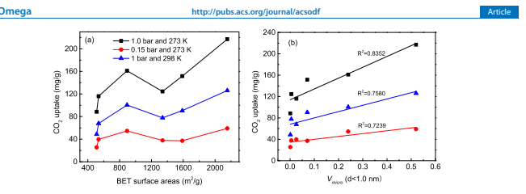 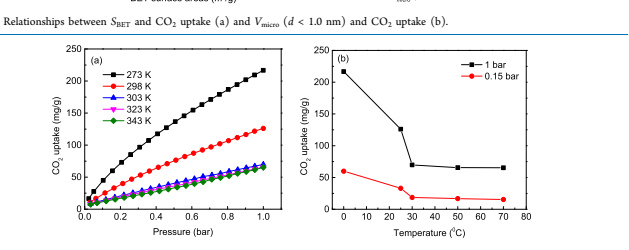

further investigate the relationship between CO2 uptake and structural properties, SBET, V(d<1.0 nm), Vtotal, and O content were plotted with the CO2 uptake, respectively (Figures 8 and S8).

The CO2 uptake of these porous carbons at 273 K and 1.0 bar, 273 K and 0.15 bar, and 298 K and 1.0 bar exhibited the same trend with the increase of SBET, respectively, which indicated that SBET had a similar effect on the CO2 uptake under the above adsorption conditions. It has been reported that Vmicro is an important factor that determines CO2 uptake; especially, the micropores with 2−3 times the pore size of the diameter of CO2 molecules (0.33 nm) would maximally enhance the adsorption potential.34,47,54,60 Then, Vmicro (d <
1.0 nm) was linearly fitted with the CO2 uptake, and the correlation coefficient (R2) was 0.8352 (at 273 K and 1 bar),
0.7239 (at 273 K and 0.15 bar), and 0.7580 (at 298 K and 1 bar), implying that Vmicro (d < 1.0 nm) had an evident positive effect on CO2 uptake, and the results were also in accordance with some previous reports.47,54,60 Meanwhile, the importance of the ultramicropores with d < 0.7 nm has been pointed out in some recent references. The ultramicropore volumes (Vultra) of these carbons are summarized in Table 1. DKC-600-2, BKC600-2, and HKC-700-2 did not have ultramicropores, but Vultra of HKC-600-2, HKC-800-2, and HKC-800-1 was 0.0064, 0.017, and 0.088 cm3/g, respectively. The relationship between Vultra and CO2 uptake (at 273 or 298 K and 1 bar) is plotted in Figure S9, and we found that HKC-800-2 with the largest Vultra had the highest CO2 uptake, and the CO2 uptake of these carbons without ultramicropores was lower than those of other carbons with ultramicropores. Hence, the importance of ultramicropores was verified again. In addition, Vtotal was also used to plot the CO2 uptake; the curves of Vtotal vs CO2 uptake were similar to SBET vs CO2 uptake. Generally, the O content of these porous carbons would inherently affect the acidity/
basicity of carbon materials, and basic groups containing pyrone, chromene, and diketone/quinone type of structures could be beneficial for CO2 adsorption.73 Here, the O content of these porous carbons seemingly did not have a regular relationship with the CO2 uptake (Figure S8), and HKC-800-2 with the highest O content did not appear to have a large enhancement of the CO2 uptake relative to HKC-700-2 with the lowest O content. The results suggested that the O doping may not be effective enough at improving CO2 capture under the dominant effect of microporosity, and previous references also showed similar results.52,54 2.6. Sensibility of Adsorption Temperature, Isosteric Heat of CO2 Adsorption (Qst), and Recycling. Considering the higher operating temperature in the adsorption of CO2 from industrial flue gases, the CO2 adsorption isotherms of HKC-800-1 at five adsorption temperatures (273−343 K)
were measured (Figure 9a). The change of CO2 uptake represented its sensibility of adsorption temperature. It can be seen that the adsorption isotherms moved down with increasing adsorption temperature and basically kept unchanged at 323 and 343 K, and the values of CO2 uptake at 1.0 and 0.15 bar under different adsorption temperatures clearly showed the change (Figure 9b). The results indicated that HKC-800-1 had good stability of CO2 adsorption at a high adsorption temperature. We think that the larger number of ultramicropores of HKC-800-1 can capture a constant number of CO2 molecules due to its strong adsorption even at high

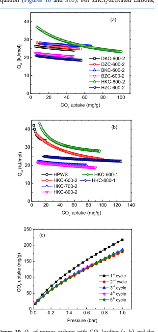

temperatures, and thus its adsorption capacity almost has no loss in a certain temperature range.

To investigate the interaction strength between these carbons and CO2, the CO2 adsorption isotherms at 273 and 298 K were used to calculate Qst by the Clausius−Clapeyron equation (Figures 10 and S10). For ZnCl2-activated carbons, DZC-600-2 had a larger Qst (28.3 kJ/mol) compared with BZC-600-2 (22.7 kJ/mol) and HZC-600-2 (21.1 kJ/mol). For KOH-activated carbons, the Qst curves of HKC-600-2 and HKC-600-1 evidently decreased with an increase of CO2 loading due to the heterogeneous adsorption sites, and thus the remaining weak sites made Qst decrease. The initial Qst of DKC-600-2, BKC-600-2, and HKC-600-2 was 26.4, 28.1, and 37.0 kJ/mol, respectively, which was less than 40 kJ/mol, ACS Omega http://pubs.acs.org/journal/acsodf Article suggesting a physical adsorption process. In addition, the initial Qst of all HKCs (Figure 10b) decreased with the increase of activation temperature; especially, Qst of HKC-600-1 reached 43.2 kJ/mol, suggesting the possibly existing weak chemical interaction. The initial Qst of the above activated carbons
(21.1−43.2 kJ/mol) exceeded the heat of liquefaction of CO2
(17 kJ/mol),67 and Qst of these carbons at low CO2 loading were comparable, even higher than many other carbon-based adsorbents, such as OM-CNS (28.4 kJ/mol),50 PMMC-800 (∼24.5 kJ/mol),53 NET2-2-700-2 (23.2 kJ/mol),54 AcA5 (∼29.7 kJ/mol),55 FC4 (24.9 kJ/mol),57 and CSC-650 (25.8 kJ/mol).72 Fortunately, HKC-800-1 with the highest CO2 uptake had a moderate Qst of 24.9 kJ/mol, which was beneficial to easy regeneration and good cycling of adsorbents.

The reclaimed HKC-800-1 was degassed at 30 °C for 30 min before the next cycle, and the reusability was measured (Figure 10c). After the first cycle, the values of CO2 uptake at 273 K
and 1 bar had slightly decreased due to the difficult desorption of some CO2 molecules and the influence of impurities possibly, but the CO2 adsorption isotherms were almost coincidental in the following four cycles and had no loss. This result indicated the acceptable recyclability. HKC-800-1 as a CO2 adsorbent could be used in pressure, vacuum swing adsorption (P/VSA) processes.

2.7. CO2/N2 Selectivity. The CO2/N2 selectivity is also an important index for CO2 capture. The N2 adsorption isotherms of all samples were measured at 273 K (Figure S11). The N2 uptake of these carbons was in the range of 2.8−15.7 mg/g at 273 K and 1 bar. DKC-600-2 has a higher N2 uptake of 15.7 mg/g, which was about one-sixth of CO2 uptake (88.5 mg/g),
implying low selectivity. Other microporous carbons have a lower ratio of N2 uptake to CO2 uptake, implying higher selectivity. To evaluate the CO2/N2 selectivity in practical applications, the selectivity at 273 K was calculated by the initial slope method (Henry's law) and ideal adsorption solution theory (IAST).74 These results are summarized in Table 2 and Figures S2,S5,S12, and S13. For Henry's law selectivity, the values of these microporous carbons were in the range of 3.84−44.0. DZC-600-2 (26.16) had higher selectivity relative to DKC-600-2 (3.84), while BKC-600-2 had (44.0) higher selectivity compared to BZC-600-2 (8.66), implying that the synthetic route also had an important effect on the CO2/N2 selectivity apart from the activator. Among all HKC carbons, HKC-800-1 had the highest CO2/N2 selectivity of 27.93, which could benefit from its highest Vmicro and V(d<1 nm).

Regarding IAST selectivity, the calculations of some samples failed because the fitting of these models showed a poor correlation coefficient. Other microporous carbons revealed selectivities of 17.3−442.0 at 273 K and 1 bar, and the order of IAST selectivity of these porous carbons was in accordance with Henry's law selectivity. BKC-600-2 had an ultrahigh selectivity of 442.0, and we thought that its higher O content of 41.46% and the largest microporosity (Vmicro/Vtotal) of 95.7%
could make important contributions. The Henry's law selectivity of HKC-800-1 (27.93) surpassed those of many porous carbons, such as commercial activated carbon (17),48 NPC-4-600 (16.6),64 c-CBAP-1N (25.7),66 Bamboo-1-973
(11.0),33 NHPCT-4-7 (22),23 HCP2a-K700 (8.7),69 and CSC650 (26.7).72

## 3. Conclusions

In this work, poplar wood sawdust-derived microporous carbons were prepared by direct chemical activation, bio-
ACS Omega http://pubs.acs.org/journal/acsodf Article pretreatment and activation, and hydrothermal pretreatment and activation. By the adjustment of the preparation routes and the optimization of the activation conditions, the produced porous carbons exhibited diverse morphologies, tunable porosity (specific surface area: 511−2153 m2/g), and a narrow micropore distribution (0.55−1.2 nm). These microporous carbons exhibited high CO2 uptake (80−217 mg/g) at 273 K
and 1 bar, which was comparable with those of many N-doped porous carbons, and high CO2/N2 selectivity and good cyclic ability. These properties make them promising adsorbents for industrial CO2 capture.

## 4. Experimental Section

4.1. Materials. PWS (diameter: 1−2 mm, length: 2−15 mm) was obtained from a wood processing factory. Sources of other materials are shown in Table 4.

Table 4. Molecular Weights, Purities, Sources, and CASNumbers of the Chemicals

| chemical   | purities   |        |           |                                         |
|------------|------------|--------|-----------|-----------------------------------------|
| name       | mol. wt.   | (%)    | CAS-no.   | sources                                 |
| ethanol    | 46.07      | ≥99.5  | 64-17-5   | Tianjin YongDa Chem. Technol. Co., Ltd. |
| KOH        | 56.11      | ≥85.0  | 1310-58-3 | Sinopharm Chemical Reagent Co., Ltd.    |
| ZnCl2      | 136.30     | ≥98    | 7646-85-7 | Sinopharm Chemical Reagent Co., Ltd.    |
| HCl        | 36.46      | 38.0   | 7647-01-0 | Sinopharm Chemical Reagent Co., Ltd.    |
| H2SO4      | 98.04      | ≥98.0  | 7664-93-9 | Nanjing Chemical Reagent Co. Ltd.       |
| CO2        | 44.0       | ≥99.99 | 124-38-9  | Changsha XinXiang Gas Chem. Co., Ltd.   |
| N2         | 28.0       | 99.999 | 7727-37-9 | Changsha XinXiang Gas Chem. Co., Ltd.   |

## 4.2. Preparation Of Microporous Carbons By Three Synthetic Routes. All Preparation Processes Of Microporous

carbons are shown in Scheme 1.

For the first route, the one-step activation carbonization, typically, approximately 1.0 g of dried PWS and 2.0 g of KOH
or ZnCl2 were thoroughly mixed in an agate mortar and heated to 600 °C at a rate of 5 °C/min under N2 flow and kept at this temperature for 2 h in a tubular furnace. After cooling, the black solids were thoroughly rinsed with 2 mol/L HCl solution, followed by deionized water until pH 7 was reached, and then dried at 80 °C in vacuum for 24 h. Finally, the samples were denoted as DKC-600-2 for KOH activation and DZC-600-2 for ZnCl2 activation.

For the second route, bio-pretreatment and activation, the bioethanol process of PWS and the main components of the residues can be seen in ref 40, and the bioethanol residues were obtained from the Ministry of Forestry Bioethanol Research Center, Changsha, China. The residues containing waste lignin/polysaccharides and adhering protein were washed with deionized water and then dried at 60 °C overnight to obtain the precursor named BPWS. The BPWS went through activated carbonization by a similar process as above, and the achieved porous carbons were denoted as BKC-600-2 for KOH activation and BZC-600-2 for ZnCl2 activation.

For the third route, hydrothermal pretreatment and activation, typically, 5 g of dried PWS was immersed in 60 mL of deionized water with 0.3 mL of H2SO4. The mixture was transferred into a 100 mL sealed stainless-steel autoclave with Teflon lining and then heated to 160 °C for 24 h. After cooling, the produced hydrochar (HPWS) was isolated by filtration, washed with deionized water and ethanol several times, and dried at 80 °C in vacuum for 24 h. Next, the HPWS
was activated through a similar process as above with different carbonization conditions. The final obtained carbons were denoted as HKC-x-y for KOH activation and HZC-x-y for ZnCl2 activation (x = 600, 700, and 800, representing the carbonization temperature; y = 1 and 2, denoting the mass ratios of activators to HPWS).

4.3. Characterization. The thermogravimetric analysis
(TGA) and derivative thermogravimetric (DTG) analysis were carried out on a Q600 thermal analysis instrument (American, TA instruments, Inc.). Fourier transform infrared (FT-IR) spectra were collected on a Nicolet 510P FT-IR spectrometer.

The porosity of samples was obtained by the N2 adsorption−
desorption isotherms at −196 °C using a Micromeritics ASAP2020M+C sorption analyzer. Before adsorption, the sample (about 0.10 g) was degassed at 120 °C for at least 8 h.

The surface areas (SBET) were calculated according to the Brunauer−Emmett−Teller (BET) equation in the range of P/
Scheme 1. Fabrication of Poplar Wood Sawdust-Derived Porous Carbons with Multiple Requirements from Three Synthetic Routes

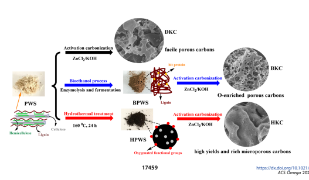

P0 = 0.001−0.15, the total pore volume (Vtotal) was determined by adsorption at P/P0 = 0.990, and the pore size distribution
(PSD) was estimated by the nonlocal density functional theory (NLDFT) method. The morphology of samples was observed by a field-emission scanning electron microscope (FE-SEM,
S4800, Hitachi Ltd., Japan). High-resolution transmission electron microscopy (HRTEM) was conducted on a Tecnai G2 F20 microscope at 200 kV. Elemental analysis (EA) data (CHNS) of the samples were detected using Elementar (Vario EL cube, Germany). X-ray diffraction (XRD) was performed on a Bruker D8 Advance diffractometer with Cu Kα radiation
(λ = 1.5418 Å (2θ = 5−80°)). The Raman spectra (LabRAM
HR Evolution, France) were obtained in the 200−2100 nm spectral region to evaluate the bonding state.

4.4. Gas Adsorption Measurements. The adsorption isotherms of CO2 and N2 were measured using a Kubo-X1000 sorption analyzer, China, at 273 and 298−343 K using an ice−
water bath and a thermostatic water bath, respectively. Before analysis, the samples were outgassed under vacuum at 120 °C
for 12 h to remove guest molecules and then cooled to room temperature, followed by introduction of CO2 or N2 in the pressure range of 0−1 bar.

- ASSOCIATED CONTENT

## *Sı Supporting Information

The Supporting Information is available free of charge at https://pubs.acs.org/doi/10.1021/acsomega.0c01918.

Yields of porous carbons; textural properties and CO2 capture performance of various adsorbents; CO2 adsorption isotherms by the Langmuir and Freundlich fitting; digital photographs of all precursors and porous carbons; DTA curves; cumulative pore volume curves; relationship between CO2 adsorption and Vtotal or O content; N2 adsorption isotherms; CO2/N2 selectivity by Henry's law and the calculation by the IAST method
(PDF)
- AUTHOR INFORMATION

## Corresponding Authors

Lishu Shao − Ministry of Forestry Bioethanol Research Center, School of Materials Science and Engineering, Central South University of Forestry and Technology, Changsha 410004, China; orcid.org/0000-0002-3547-9870; Email: lishushao@csuft.edu.cn Jienan Chen − Ministry of Forestry Bioethanol Research Center, School of Materials Science and Engineering, Central South University of Forestry and Technology, Changsha 410004, China; Email: chenjnx@163.com

## Authors

Yafei Sang − College of Chemistry and Chemical Engineering, Central South University, Changsha 410083, China Na Liu − Ministry of Forestry Bioethanol Research Center, School of Materials Science and Engineering, Central South University of Forestry and Technology, Changsha 410004, China Jun Liu − College of Resources and Environment, Hunan Agricultural University, Changsha 410128, China Peng Zhan − Ministry of Forestry Bioethanol Research Center, School of Materials Science and Engineering, Central South University of Forestry and Technology, Changsha 410004, China

Jianhan Huang − College of Chemistry and Chemical Engineering, Central South University, Changsha 410083, China; orcid.org/0000-0002-3838-0622 Complete contact information is available at: https://pubs.acs.org/10.1021/acsomega.0c01918

## Notes

The authors declare no competing financial interest.

- ACKNOWLEDGMENTS
The National Key Research and Development Program of China (Nos. 2018YFD0600302 and 2019YFB1503804), Huxiang High-Level Talent Gathering Project of HUNAN Province (2019RS1063), and the Major Science and Technology Program of Hunan Province (No. 2017NK1010)
are gratefully acknowledged for the financial support. Hunan Engineering Research Center for Woody Biomass Conversion and Hunan International Joint Laboratory of Woody Biomass Conversion, Central South University of Forestry and Technology, Changsha, 410004, China, is gratefully acknowledged.

- REFERENCES
(1) Huaman, R. N. E.; Jun, T. X. Energy Related CO2 Emissions and the Progress on CCS Projects: A Review. Renewable Sustainable Energy Rev. 2014, 31, 368−385.

(2) Abas, N.; Khan, N. Carbon Conundrum, Climate Change, CO2 Capture and Consumptions. J. CO2 Util. 2014, 8, 39−48.

(3) Rahman, F. A.; Aziz, M. M. A.; Saidur, R.; Bakar, W. A. W. A.;
Hainin, M. R.; Putrajaya, R.; Hassan, N. A. Pollution to Solution:
Capture and Sequestration of Carbon Dioxide (CO2) and Its Utilization as A Renewable Energy Source for A Sustainable Future.

Renewable Sustainable Energy Rev. 2017, 71, 112−126.

(4) Gao, W. Y.; Wu, H. F.; Leng, K. Y.; Sun, Y. Y.; Ma, S. Q.

Inserting CO2 into Aryl C-H Bonds of Metal-Organic Frameworks: CO2 Utilization for Direct Heterogeneous C-H Activation. Angew.

Chem., Int. Ed. 2016, 55, 5472−5476.

(5) Rochelle, G. T. Amine Scrubbing for CO2 Capture. Science 2009, 325, 1652−1654.

(6) Lee, J. H.; Lee, H. J.; Lim, S. Y.; Kim, B. G.; Choi, J. W.

Combined CO2-Philicity and Ordered Mesoporosity for Highly Selective CO2 Capture at High Temperatures. J. Am. Chem. Soc. 2015, 137, 7210−7216.

(7) Verougstraete, B.; Martín-Calvo, A.; Van der Perre, S.; Baron, G.;
Finsy, V.; Denayer, J. F. M. A New Honeycomb Carbon Monolith for CO2 Capture by Rapid Temperature Swing Adsorption Using Steam Regeneration. Chem. Eng. J. 2020, 383, No. 123075.

(8) Ben-Mansour, R.; Habib, M. A.; Bamidele, O. E.; Basha, M.;
Qasem, N. A. A.; Peedikakkal, A.; Laoui, T.; Ali, M. Carbon Capture by Physical Adsorption: Materials, Experimental Investigations and Numerical Modeling and Simulations-A Review. Appl. Energy 2016, 161, 225−255.

(9) An, L. Y.; Liu, S. F.; Wang, L. L.; Wu, J. Y.; Wu, Z. Z.; Ma, C. D.;
Yu, Q. K.; Hu, X. Novel Nitrogen-Doped Porous Carbons Derived from Graphene for Effective CO2 Capture. Ind. Eng. Chem. Res. 2019, 58, 3349−3358.

(10) Rehman, A.; Park, S. J. Comparative Study of Activation Methods to Design Nitrogen-Doped Ultramicroporous Carbons as Efficient Contenders for CO2 Capture. Chem. Eng. J. 2018, 352, 539−
548.

(11) Yue, L. M.; Rao, L. L.; Wang, L. L.; An, L. Y.; Hou, C. Y.; Ma, C. D.; DaCosta, H.; Hu, X. Efficient CO2 Adsorption on NitrogenDoped Porous Carbons Derived from D-Glucose. Energy Fuels 2018, 32, 6955−6963.

(12) Yang, P.; Rao, L.; Zhu, W.; Wang, L.; Ma, R.; Chen, F.; Lin, G.;
Hu, X. Porous Carbons Derived from Sustainable Biomass via a Facile One-Step Synthesis Strategy as Efficient CO2 Adsorbents. Ind. Eng.

Chem. Res. 2020, 59, 6194−6201.

(13) Liu, S.; Rao, L.; Yang, P.; Wang, X.; Wang, L.; Ma, R.; Yue, L.;
Hu, X. Superior CO2 Uptake on Nitrogen Doped Carbonaceous Adsorbents from Commercial Phenolic Resin. J. Environ. Sci. 2020, 93, 109−116.

(14) Xu, Y. H.; Cui, D.; Zhang, S. R.; Xu, G. J.; Su, Z. M. Facile Synthesis of Conjugated Microporous Polymer-Based Porphyrin Units for Adsorption of CO2 and Organic Vapors. Polym. Chem.

2019, 10, 819−822.

(15) Geng, T. M.; Chen, G. F.; Ma, L. Z.; Zhang, C.; Zhang, W. Y.;
Xu, H. The Spirobifluorene-Based Fluorescent Conjugated Microporous Polymers for Reversible Adsorbing Iodine, Fluorescent Sensing Iodine and Nitroaromatic Compounds. Eur. Polym. J. 2019, 115, 37−44.

(16) Gemeda, A. E.; De Angelis, M. G.; Du, N. Y.; Li, N. W.; Guiver, M. D.; Sarti, G. C. Mixed Gas Sorption in Glassy Polymeric Membranes. III. CO2/CH4 Mixtures in A Polymer of Intrinsic Microporosity (PIM-1): Effect of Temperature. J. Membr. Sci. 2017, 524, 746−757.

(17) Ding, L. G.; Yao, B. J.; Li, F.; Shi, S. C.; Huang, N.; Yin, H. B.;
Guan, Q.; Dong, Y. B. Ionic Liquid-Decorated COF and Its Covalent Composite Aerogel for Selective CO2 Adsorption and Catalytic Conversion. J. Mater. Chem. A 2019, 7, 4689−4698.

(18) Liang, R. R.; Xu, S. Q.; Qi, Q. Y.; Zhao, X. Fabricating Organic Nanotubes through Selective Disassembly of Two-Dimensional Covalent Organic Frameworks. J. Am. Chem. Soc. 2020, 142, 70−74.

(19) Wahono, S. K.; Stalin, J.; Addai-Mensah, J.; Skinner, W.; Vinu, A.; Vasilev, K. Physico-Chemical Modification of Natural MordeniteClinoptilolite Zeolites and Their Enhanced CO2 Adsorption Capacity.

Microporous Mesoporous Mater. 2020, 294, No. 109871.

(20) Ding, M.; Flaig, R. W.; Jiang, H. L.; Yaghi, O. M. Carbon Capture and Conversion Using Metal-Organic Frameworks and MOF-Based Materials. Chem. Soc. Rev. 2019, 48, 2783−2828.

(21) Ashourirad, B.; Arab, P.; Verlander, A.; El-Kaderi, H. M. From Azo-Linked Polymers to Microporous Heteroatom-Doped Carbons: Tailored Chemical and Textural Properties for Gas Separation. ACS
Appl. Mater. Interfaces 2016, 8, 8491−8501.

(22) Singh, G.; Lakhi, K. S.; Sil, S.; Bhosale, S. V.; Kim, I.; Albahily, K.; Vinu, A. Biomass Derived Porous Carbon for CO2 Capture.

Carbon 2019, 148, 164−186.

(23) Chang, B. B.; Shi, W. W.; Yin, H.; Zhang, S. R.; Yang, B. C.

Poplar Catkin-Derived Self-Templated Synthesis of N-Doped Hierarchical Porous Carbon Microtubes for Effective CO2 Capture.

Chem. Eng. J. 2019, 358, 1507−1518.

(24) Liu, S. F.; Ma, R.; Hu, X.; Wang, L. L.; Wang, X. Y.; Radosz, M.; Fan, M. H. CO2 Adsorption on Hazelnut-Shell-Derived NitrogenDoped Porous Carbons Synthesized by Single-Step Sodium Amide Activation. Ind. Eng. Chem. Res. 2020, 59, 7046−7053.

(25) Rehman, A.; Park, S. J. Tunable Nitrogen-Doped Microporous Carbons: Delineating the Role of Optimum Pore Size for Enhanced CO2 Adsorption. Chem. Eng. J. 2019, 362, 731−742.

(26) Rehman, A.; Park, S. J. From Chitosan to Urea-Modified Carbons: Tailoring the Ultra-Microporosity for Enhanced CO2 Adsorption. Carbon 2020, 159, 625−637.

(27) Guo, D. D.; Xin, R. R.; Wang, Y. F.; Jiang, W.; Gao, Q. P.; Hu, G. S.; Fan, M. H. N-Doped Carbons with Hierarchically Micro- and Mesoporous Structure Derived from Sawdust for High Performance Supercapacitors. Microporous Mesoporous Mater. 2019, 279, 323−333.

(28) Song, J.; Shen, W. Z.; Wang, J. G.; Fan, W. B. Superior CarbonBased CO2 Adsorbents Prepared from Poplar Anthers. Carbon 2014, 69, 255−263.

(29) Xia, L. Y.; Li, X. J.; Wu, Y. Q.; Rong, M. Z. Wood-Derived Carbons with Hierarchical Porous Structures and Monolithic Shapes Prepared by Biological-Template and Self-Assembly Strategies. ACS
Sustainable Chem. Eng. 2015, 3, 1724−1731.

(30) Gao, S. Y.; Li, X. G.; Li, L. Y.; Wei, X. J. A Versatile Biomass Derived Carbon Material for Oxygen Reduction Reaction, Super-
ACS Omega http://pubs.acs.org/journal/acsodf Article capacitors and Oil/Water Separation. Nano Energy 2017, 33, 334−
342.

(31) Li, H. Y.; Wan, W. J.; Liu, X. J.; Liu, H. X.; Shen, S. B.; Lv, F.;
Luo, J. Poplar-Catkin-Derived N, P-co-Doped Carbon Microtubes as Efficient Oxygen Electrocatalysts for Zn-air Batteries. ChemElectroChem 2018, 5, 1113−1119.

(32) Su, X. L.; Cheng, M. Y.; Fu, L.; Yang, J. H.; Zheng, X. C.; Guan, X. X. Superior Supercapacitive Performance of Hollow Activated Carbon Nanomesh with Hierarchical Structure Derived from Poplar Catkins. J. Power Sources 2017, 362, 27−38.

(33) Manya, J. J.; Gonza ̀ lez, B.; Azuara, M.; Arner, G. Ultra- ́
microporous Adsorbents Prepared from Vine Shoots-Derived Biochar with High CO2 Uptake and CO2/N2 Selectivity. Chem. Eng. J. 2018, 345, 631−639.

(34) To, J. W.; He, J.-J.; Mei, J.-G.; Haghpanah, R.; Chen, Z.;
Kurosawa, T.; Chen, S.-C.; Wilcox, J.; Bao, Z.-N.; et al. Hierarchical N-Doped Carbon as CO2 Adsorbent with High CO2 Selectivity from Rationally Designed Polypyrrole Precursor. J. Am. Chem. Soc. 2016, 138, 1001−1009.

(35) Yan, R. Y.; Heil, T.; Presser, V.; Walczak, R.; Antonietti, M.;
Oschatz, M. Ordered Mesoporous Carbons with High Micropore Content and Tunable Structure Prepared by Combined Hard and Salt Templating as Electrode Materials in Electric Double-Layer Capacitors. Adv. Sustainable Syst. 2018, 2, No. 1700128.

(36) Balahmar, N.; Mitchell, A. C.; Mokaya, R. Generalized Mechanochemical Synthesis of Biomass-Derived Sustainable Carbons for High Performance CO2 Storage. Adv. Energy Mater. 2015, 5, No. 1500867.

(37) Zhang, L.; You, T. T.; Zhou, T.; Zhou, X.; Xu, F.

Interconnected Hierarchical Porous Carbon from Lignin-derived Byproducts of Bioethanol Production for Ultra-High Performance Supercapacitors. ACS Appl. Mater. Interfaces 2016, 8, 13918−13925.

(38) Rao, L. L.; Ma, R.; Liu, S. F.; Wang, L. L.; Wu, Z. Z.; Yang, J.;
Hu, X. Nitrogen Enriched Porous Carbons from D-glucose with Excellent CO2 Capture Performance. Chem. Eng. J. 2019, 362, 794−
801.

(39) Chen, W. M.; Wang, X.; Hashisho, Z.; Feizbakhshan, M.;
Shariaty, P.; Niknaddaf, S.; Zhou, X. Y. Template-Free and Fast OneStep Synthesis from Enzymatic Hydrolysis Lignin to Hierarchical Porous Carbon for CO2 Capture. Microporous Mesoporous Mater.

2019, 280, 57−65.

(40) Liu, N.; Chen, J. N.; Zhan, P.; Zhang, L.; Zhou, X. X.; Zeng, B.

Q.; Wu, Z. P.; Wang, H. Optimization of Mixed Enzymolysis of Acidexploded Poplar Wood Residues for Directional Bioconversion.

BioResources 2020, 15, 1945−1958.

(41) Lee, C. W.; Yoon, S. B.; Kim, H. K.; Youn, H. C.; Han, J.; Roh, K. C.; Kim, K. B. A Two-dimensional Highly Ordered Mesoporous Carbon/Graphene Nanocomposite for Electrochemical Double Layer Capacitors: Effects of Electrical and Ionic Conduction Pathways. J.

Mater. Chem. A 2015, 3, 2314−2322.

(42) Ding, J.; Wang, H.; Li, Z.; Cui, K.; Karpuzov, D.; Tan, X.;
Kohandehghan, A.; Mitlin, D. Peanut Shell Hybrid Sodium Ion Capacitor with Extreme Energy-Power Rivals Lithium Ion Capacitors.

Energy Environ. Sci. 2015, 8, 941−955.

(43) Zhu, Y.; Murali, S.; Stoller, M. D.; Ganesh, K.; Cai, W.;
Ferreira, P. J.; Pirkle, A.; Wallace, R. M.; Cychosz, K. A.; Thommes, M.; Su, D.; Stach, E. A.; Ruoff, R. S. Carbon-based Supercapacitors Produced by Activation of Graphene. Science 2011, 332, 1537−1541.

(44) Jain, A.; Balasubramanian, R.; Srinivasan, M. P. Hydrothermal Conversion of Biomass Waste to Activated Carbon with High Porosity: A review. Chem. Eng. J. 2016, 283, 789−805.

(45) Foo, K. Y.; Hameed, B. H. Factors Affecting the Carbon Yield and Adsorption Capability of the Mangosteen Peel Activated Carbon Prepared by Microwave Assisted K2CO3 Activation. Chem. Eng. J.

2012, 180, 66−74.

(46) Thommes, M.; Kaneko, K.; Neimark, A. V.; Olivier, J. P.;
Rodriguez-Reinoso, F.; Rouquerol, J.; Sing, K. S. Physisorption of Gases, with Special Reference to the Evaluation of Surface Area and Pore Size Distribution (IUPAC Technical Report). Pure Appl. Chem.

2015, 87, 1051−1069.

(47) Shao, L. S.; Liu, M. Q.; Huang, J. H.; Liu, Y. N. CO2 Capture by Nitrogen-Doped Porous Carbons Derived from NitrogenContaining Hyper-Cross-Linked Polymers. J. Colloid Interface Sci.

2018, 513, 304−313.

(48) Zhang, C. M.; Song, W.; Ma, Q. L.; Xie, L. J.; Zhang, X. C.;
Guo, H. Enhancement of CO2 Capture on Biomass-Based Carbon from Black Locust by KOH Activation and Ammonia Modification.

Energy Fuels 2016, 30, 4181−4190.

(49) Yuan, B.; Wu, X. F.; Chen, Y. X.; Huang, J. H.; Luo, H. M.;
Deng, S. G. Adsorption of CO2, CH4, and N2 on Ordered Mesoporous Carbon: Approach for Greenhouse Gases Capture and Biogas Upgrading. Environ. Sci. Technol. 2013, 47, 5474−5480.

(50) Chen, C. W.; Yu, Y. K.; He, C.; Wang, L.; Huang, H.; Albilali, R.; Cheng, J.; Hao, Z. P. Efficient Capture of CO2 over Ordered Micro-Mesoporous Hybrid Carbon Nanosphere. Appl. Surf. Sci. 2018, 439, 113−121.

(51) Zhang, Z.; Luo, D.; Lui, G.; Li, G. R.; Jiang, G. P.; Cano, Z. P.;
Deng, Y. P.; Du, X. J.; Yin, S.; Chen, Y. F.; Zhang, M. H.; Yan, Z. F.; Chen, Z. W. In-situ Ion-Activated Carbon Nanospheres with Tunable Ultramicroporosity for Superior CO2 Capture. Carbon 2019, 143, 531−541.

(52) Ma, X. C.; Li, L. Q.; Zeng, Z.; Chen, R. F.; Wang, C. H.; Zhou, K.; Li, H. L. Experimental and Theoretical Demonstration of the Relative Effects of O-doping and N-doping in Porous Carbons for CO2 Capture. Appl. Surf. Sci. 2019, 481, 1139−1147.

(53) Qi, S. C.; Liu, Y.; Peng, A. Z.; Xue, D. M.; Liu, X.; Liu, X. Q.;
Sun, L. B. Fabrication of Porous Carbons from Mesitylene for Highly Efficient CO2 Capture: A Rational Choice Improving the Carbon Loop. Chem. Eng. J. 2019, 361, 945−952.

(54) Liu, M. Q.; Shao, L. S.; Huang, J. H.; Liu, Y. N. O-Containing Hyper-Cross-Linked Polymers and Porous Carbons for CO2 Capture.

Microporous Mesoporous Mater. 2018, 264, 104−111.

(55) Liu, Z.; Zhang, Z.; Jia, Z. J.; Zhao, L.; Zhang, T. T.; Xing, W.;
Komarneni, S.; Subhan, F.; Yan, Z. F. New Strategy to Prepare Ultramicroporous Carbon by Ionic Activation for Superior CO2 Capture. Chem. Eng. J. 2018, 337, 290−299.

(56) Kumar, K. V.; Gadipelli, S.; Preuss, K.; Porwal, H.; Zhao, T. T.;
Guo, Z. X.; Titirici, M.-M. Salt Templating with Pore Padding: Hierarchical Pore Tailoring towards Functionalized Porous Carbons.

ChemSusChem 2017, 10, 199−209.

(57) Chen, C. W.; Huang, H.; Yu, Y. K.; Shi, J. W.; He, C.; Albilali, R.; Pan, H. Template-free Synthesis of Hierarchical Porous Carbon with Controlled Morphology for CO2 Efficient Capture. Chem. Eng. J.

2018, 353, 584−594.

(58) Zhang, Y.; Liu, L.; Zhang, P. X.; Wang, J.; Xu, M.; Deng, Q.;
Zeng, Z. L.; Deng, S. G. Ultra-high Surface Area and Nitrogen-Rich Porous Carbons Prepared by A Low-Temperature Activation Method with Superior Gas Selective Adsorption and Outstanding Supercapacitance Performance. Chem. Eng. J. 2019, 355, 309−319.

(59) Wang, Y.; Zou, H. B.; Zeng, S. J.; Pan, Y.; Wang, R. W.; Wang, X.; Sun, Q. L.; Zhang, Z. T.; Qiu, S. L. A One-Step Carbonization Route towards Nitrogen-Doped Porous Carbon Hollow Spheres with Ultrahigh Nitrogen Content for CO2 Adsorption. Chem. Commun.

2015, 51, 12423−12426.

(60) Serafin, J.; Narkiewicz, U.; Morawski, A. W.; Wrobel, R. J.; ́
Michalkiewicz, B. Highly Microporous Activated Carbons from Biomass for CO2 Capture and Effective Micropores at Different Conditions. J. CO2 Util. 2017, 18, 73−79.

(61) Yang, S. J.; Antonietti, M.; Fechler, N. Self-Assembly of Metal Phenolic Mesocrystals and Morphosynthetic Transformation toward Hierarchically Porous Carbons. J. Am. Chem. Soc. 2015, 137, 8269−
8273.

(62) Wu, Y.; Wang, J. X.; Muhammad, Y.; Subhan, S.; Zhang, Y. B.;
Ling, Y.; Li, J.; Zhao, Z. X.; Zhao, Z. X. Pyrrolic N-Enriched Carbon Fabricated from Dopamine-Melamine via Fast Mechanochemical Copolymerization for Highly Selective Separation of CO2 from CO2/
N2. Chem. Eng. J. 2018, 349, 92−100.

ACS Omega http://pubs.acs.org/journal/acsodf Article
(63) Wei, H.; Chen, J.; Fu, N.; Chen, H.; Lin, H.; Han, S. BiomassDerived Nitrogen-Doped Porous Carbon with Superior Capacitive Performance and High CO2 Capture Capacity. Electrochim. Acta 2018, 266, 161−169.

(64) Shao, L. S.; Li, Y.; Huang, J. H.; Liu, Y. N. Synthesis of Triazine-Based Porous Organic Polymers Derived N-Enriched Porous Carbons for CO2 Capture. Ind. Eng. Chem. Res. 2018, 57, 2856−2865.

(65) Wang, J. C.; Liu, Q. An Efficient One-Step Condensation and Activation Strategy to Synthesize Porous Carbons with Optimal Micropore Sizes for Highly Selective CO2 Adsorption. Nanoscale 2014, 6, 4148−4156.

(66) Puthiaraj, P.; Lee, Y. R.; Ahn, W. S. Microporous AmineFunctionalized Aromatic Polymers and Their Carbonized Products for CO2 adsorption. Chem. Eng. J. 2017, 319, 65−74.

(67) Parshetti, G. K.; Chowdhury, S.; Balasubramanian, R. Biomass Derived Low-Cost Microporous Adsorbents for Efficient CO2 Capture. Fuel 2015, 148, 246−254.

(68) Li, K. M.; Tian, S. C.; Jiang, J. G.; Wang, J. M.; Chen, X. J.; Yan, F. Pine Cone Shell-Based Activated Carbon Used for CO2 Adsorption. J. Mater. Chem. A 2016, 4, 5223−5234.

(69) Shao, L. S.; Sang, Y. F.; Huang, J. H.; Liu, Y. N. Triazine-Based Hyper-Cross-Linked Polymers with Inorganic-Organic Hybrid Framework Derived Porous Carbons for CO2 Capture. Chem. Eng. J. 2018, 353, 1−14.

(70) Li, J. X.; Michalkiewicz, B.; Min, J. K.; Ma, C. D.; Chen, X. C.;
Gong, J.; Mijowska, E.; Tang, T. Selective Preparation of BiomassDerived Porous Carbon with Controllable Pore Sizes toward Highly Efficient CO2 Capture. Chem. Eng. J. 2019, 360, 250−259.

(71) Hong, S. M.; Yoon, H. J.; Choi, Y. J.; Cho, Y. Z.; Mun, S. Y.;
Pol, V. G.; Lee, K. B. Solving Two Environmental Problems Simultaneously: Scalable Production of Carbon Microsheets from Structured Packing Peanuts with Tailored Microporosity for Efficient CO2 Capture. Chem. Eng. J. 2020, 379, No. 122219.

(72) Zhou, J. J.; Li, D. W.; Wang, Y.; Tian, Y. Y.; Zhang, Z. B.; Ling, W.; Feng, W. Effect of the Feedstock Type on the Volumetric LowPressure CO2 Capture Performance of Activated Carbons. Energy Fuels 2018, 32, 12711−12720.

(73) Saha, D.; Kienbaum, M. J. Role of Oxygen, Nitrogen and Sulfur Functionalities on the Surface of Nanoporous carbons in CO2 Adsorption: A Critical Review. Microporous Mesoporous Mater.

2019, 287, 29−55.

(74) Myers, A.; Prausnitz, J. Thermodynamics of Mixed-Gas Adsorption. AIChE J. 1965, 11, 121−127.
